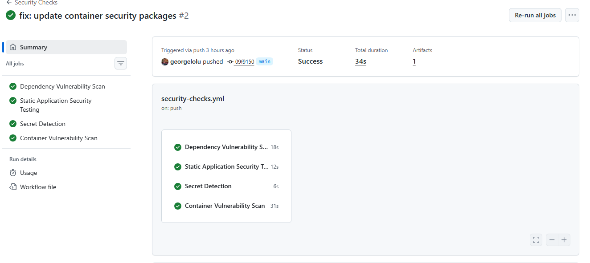
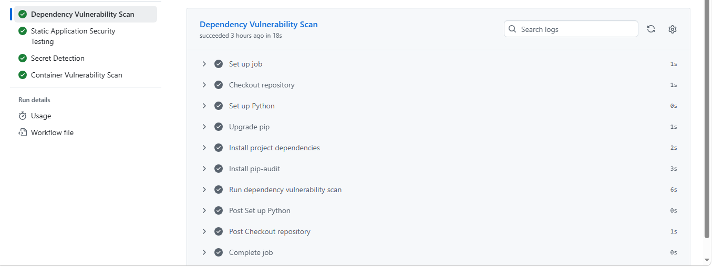
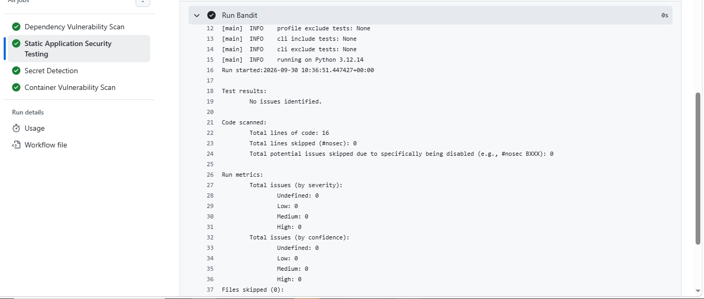
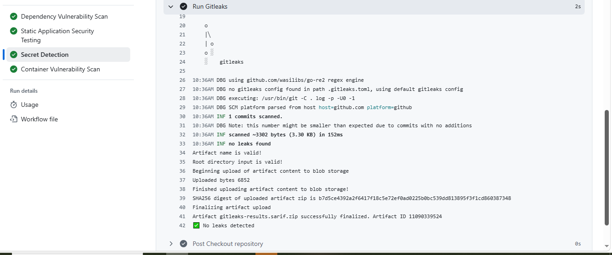
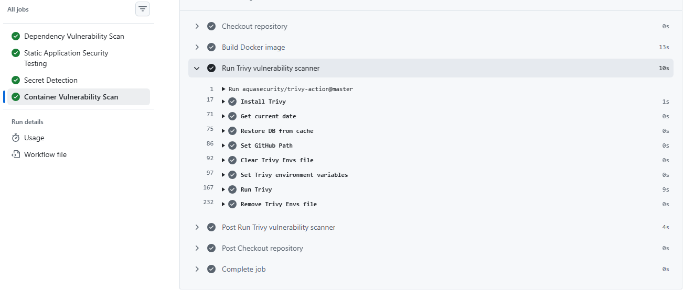
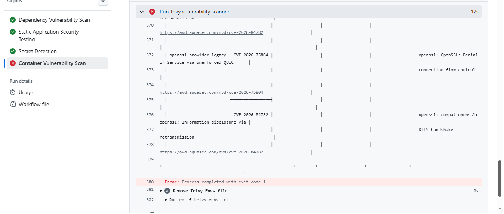
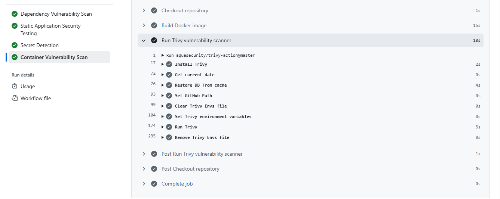

# GitHub Actions Security Checks

A DevSecOps demonstration project that integrates automated security checks into a GitHub Actions CI/CD pipeline.

The project demonstrates how application dependencies, source code, secrets, and container images can be continuously scanned for security issues before changes are accepted into the main branch.

## 🚀 Security Pipeline

```text
                         Git Push / Pull Request
                                  │
                                  ▼
                         ┌───────────────────┐
                         │  GitHub Actions   │
                         └─────────┬─────────┘
                                   │
             ┌─────────────────────┼─────────────────────┐
             │                     │                     │
             ▼                     ▼                     ▼
       ┌─────────────┐       ┌─────────────┐      ┌─────────────┐
       │  pip-audit  │       │   Bandit    │      │  Gitleaks   │
       │ Dependency  │       │    SAST     │      │   Secrets   │
       │    Scan     │       │             │      │    Scan     │
       └──────┬──────┘       └──────┬──────┘      └──────┬──────┘
              │                     │                     │
              └─────────────────────┼─────────────────────┘
                                    │
                                    ▼
                            ┌────────────────┐
                            │  Docker Build  │
                            └───────┬────────┘
                                    │
                                    ▼
                            ┌────────────────┐
                            │     Trivy      │
                            │ Container Scan │
                            └───────┬────────┘
                                    │
                                    ▼
                           Security Gate Passed
                                    │
                                    ▼
                                ✅ GREEN
```

## 🔐 Security Checks

### 1. Dependency Vulnerability Scanning

**Tool:** `pip-audit`

Scans Python dependencies against known vulnerability databases.

The pipeline fails when vulnerable dependencies are detected.

### 2. Static Application Security Testing

**Tool:** `Bandit`

Analyzes Python source code for common security issues and insecure coding patterns.

### 3. Secret Detection

**Tool:** `Gitleaks`

Scans the repository for accidentally committed credentials, API keys, tokens, and other sensitive information.

### 4. Container Vulnerability Scanning

**Tool:** `Trivy`

Scans the Docker image for vulnerabilities in:

* Operating-system packages
* Python packages
* Other image components

The security gate is configured to fail when HIGH or CRITICAL vulnerabilities are detected.

## 🛠️ Technology Stack

| Technology     | Purpose                             |
| -------------- | ----------------------------------- |
| Python         | Application runtime                 |
| Flask          | Web application framework           |
| Docker         | Application containerization        |
| GitHub Actions | CI/CD automation                    |
| pip-audit      | Python dependency security scanning |
| Bandit         | Python SAST                         |
| Gitleaks       | Secret detection                    |
| Trivy          | Container vulnerability scanning    |
| pytest         | Automated testing                   |

## 📁 Project Structure

```text
github-actions-security-checks/
├── .github/
│   └── workflows/
│       └── security-checks.yml
├── app/
│   ├── __init__.py
│   └── app.py
├── tests/
│   └── test_app.py
├── Dockerfile
├── pytest.ini
├── requirements.txt
└── README.md
```

## ⚙️ Application

The project contains a small Flask application with two endpoints:

### Application endpoint

```text
GET /
```

Returns:

```json
{
  "message": "GitHub Actions Security Checks Demo",
  "status": "running"
}
```

### Health endpoint

```text
GET /health
```

Returns:

```json
{
  "status": "healthy"
}
```

## 💻 Local Setup

Clone the repository:

```bash
git clone https://github.com/georgelolu/github-actions-security-checks.git
cd github-actions-security-checks
```

Create a Python virtual environment:

```bash
python3 -m venv .venv
source .venv/bin/activate
```

Install dependencies:

```bash
pip install -r requirements.txt
```

## 🧪 Run Tests

Run the automated tests:

```bash
pytest -v
```

Expected result:

```text
2 passed
```

## 🔍 Run Security Checks Locally

### Dependency Scan

```bash
pip install pip-audit
pip-audit
```

### Static Analysis

```bash
pip install bandit
bandit -r app -ll
```

### Docker Build

```bash
docker build -t security-demo:latest .
```

### Run the Application

```bash
docker run -d -p 5000:5000 --name security-demo security-demo:latest
```

Test the application:

```bash
curl http://localhost:5000
```

Test the health endpoint:

```bash
curl http://localhost:5000/health
```

Remove the container:

```bash
docker rm -f security-demo
```

## 📸 Security Evidence

The repository includes evidence from the GitHub Actions security pipeline demonstrating dependency scanning, SAST, secret detection, container vulnerability scanning, and vulnerability remediation.

### 1. Overall Security Pipeline

All four automated security checks completed successfully in GitHub Actions.



### 2. Dependency Vulnerability Scan

`pip-audit` completed successfully with no known vulnerabilities detected in the project dependencies.



### 3. Static Application Security Testing

`Bandit` completed successfully and reported no security findings at the configured severity level.



### 4. Secret Detection

`Gitleaks` completed successfully, confirming that no exposed secrets were detected in the repository.



### 5. Container Vulnerability Scan

`Trivy` successfully scanned the Docker image and the security gate passed after remediation.



### 6. Security Gate Failure Detection

During development, the Trivy security gate detected six HIGH-severity OpenSSL-related vulnerabilities in the Docker image.



### 7. Remediation and Verification

The Dockerfile was updated to refresh the Debian base packages. The image was rebuilt and rescanned, after which the Trivy security gate passed successfully.



### DevSecOps Validation Flow

```text
Security Scan
     │
     ▼
Vulnerabilities Detected
     │
     ▼
Dockerfile Remediation
     │
     ▼
Image Rebuilt
     │
     ▼
Trivy Re-scan
     │
     ▼
Security Gate Passed
## 🛡️ Container Security

The Docker image is scanned with Trivy using the following security policy:

```yaml
severity: HIGH,CRITICAL
exit-code: "1"
ignore-unfixed: true
```

This means the CI pipeline fails when HIGH or CRITICAL vulnerabilities with available fixes are detected.

## 🔧 Security Remediation Example

During development, the Trivy container scan detected six HIGH-severity OpenSSL-related vulnerabilities in the Debian base packages.

The affected packages included:

* `libssl3t64`
* `openssl`
* `openssl-provider-legacy`

The Dockerfile was updated to install the latest available Debian security packages during the image build:

```dockerfile
RUN apt-get update \
    && apt-get upgrade -y \
    && pip install --no-cache-dir -r requirements.txt \
    && rm -rf /var/lib/apt/lists/*
```

The image was rebuilt from scratch and rescanned.

The subsequent Trivy scan passed successfully.

This demonstrates the security workflow:

```text
Vulnerability Detected
        │
        ▼
Investigate Finding
        │
        ▼
Update Vulnerable Packages
        │
        ▼
Rebuild Container
        │
        ▼
Rescan Image
        │
        ▼
Security Gate Passed
```

## ✅ Current CI/CD Status

The GitHub Actions pipeline currently contains four security jobs:

```text
Dependency Vulnerability Scan       ✅
Static Application Security Test   ✅
Secret Detection                   ✅
Container Vulnerability Scan       ✅
```

The pipeline is configured to run on:

* Pushes to `main`
* Pull requests targeting `main`

## 🎯 DevSecOps Objectives

This project demonstrates practical implementation of:

* Shift-left security
* Automated vulnerability detection
* Static application security testing
* Dependency security
* Secret detection
* Container security
* CI/CD security gates
* Security remediation
* Automated security verification

## 📌 Key Learning Outcomes

Through this project, the following DevSecOps concepts are demonstrated:

1. Integrating security tools into CI/CD pipelines.
2. Detecting vulnerable application dependencies.
3. Identifying insecure Python code patterns.
4. Preventing accidental secret exposure.
5. Scanning container images for OS-level vulnerabilities.
6. Remediating container vulnerabilities.
7. Using CI security gates to prevent vulnerable builds from progressing.
8. Verifying remediation through automated rescanning.

## 👨‍💻 Author

**George Omololu Akinbi**

Cloud & DevOps Engineer

GitHub: https://github.com/georgelolu

LinkedIn: https://www.linkedin.com/in/georgelolu

